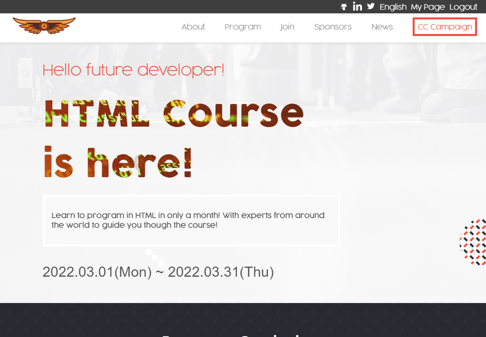
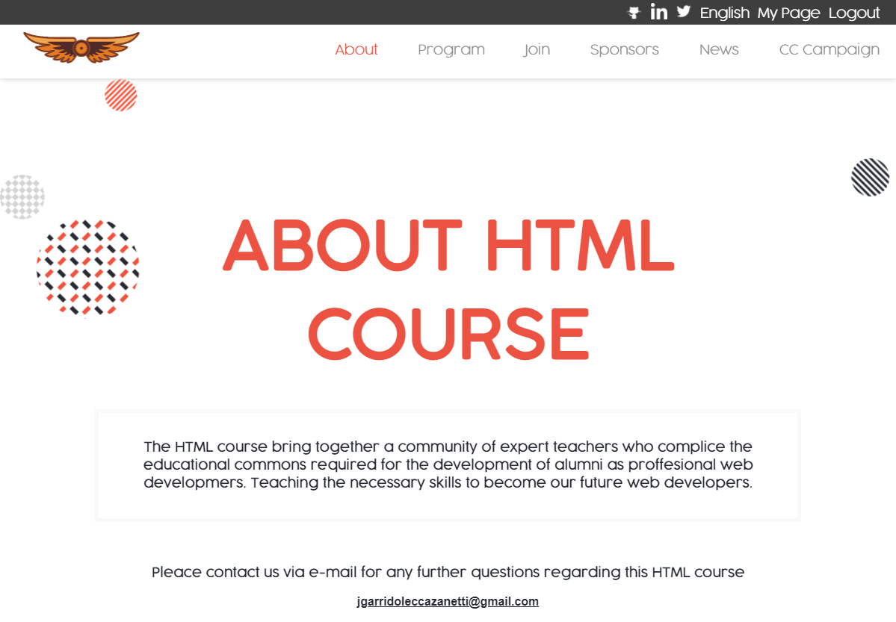

# HTML Course

> This is my capstone project for the first module of the microverse program.

Home and about pages.

## Built With

- HTML
- CSS
- Javascript

## Live Demo

[Live Demo Link](https://kakalanp.github.io/Capstonproj-Conference-page/)

## Getting Started

To have a local copy of this project, follow theese simple steps:

1. Open the terminal comand line window
2. `git clone https://github.com/Kakalanp/Capstonproj-Conference-page.git`
3. Open the index.html file with any browser
4. Have fun!

## Authors

👤 **Joaquín Garrido Lecca**

- GitHub: [@Kakalanp](https://github.com/Kakalanp)
- LinkedIn: [LinkedIn](https://www.linkedin.com/in/joaquín-garrido-lecca-zanetti-623583204/)
- Twitter: [@LeccaJoaquin](https://twitter.com/LeccaJoaquin)

## 🤝 Contributing

Contributions, issues, and feature requests are welcome!

Feel free to check the [issues page](https://github.com/Kakalanp/Capstonproj-Conference-page/issues).

## Show your support

Give a ⭐️ if you like this project!

## Acknowledgments

- Hat tip to anyone whose code was used

- Logo provided by [LogoLoco.com](https://www.logologo.com/) Logo licence in the About page.

- All icons (including the teachers photos) were given by [icons8](https://icons8.com/) Thanks for these amazing icons!

- Some teachers names and descriptions were burrowed from [Tomas Laurinavicius's](https://tutsplus.com/authors/tomas-laurinavicius) Article named [10 People Who Have Shaped the Web Design Industry](https://webdesign.tutsplus.com/articles/10-people-who-have-shaped-the-web-design-industry--cms-31334) on [evantotutus](https://tutsplus.com/). Thanks for the well done research!

## 📝 License

This project is [MIT](./MIT.md) licensed.
